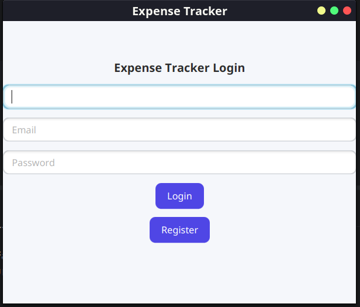
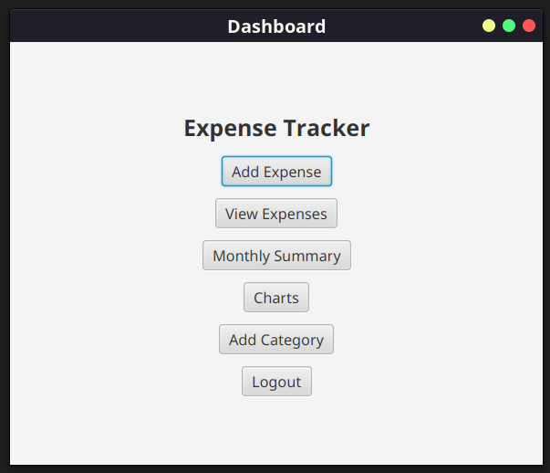
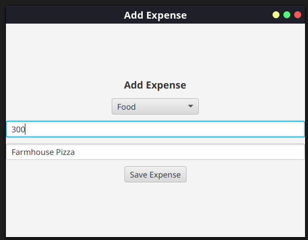
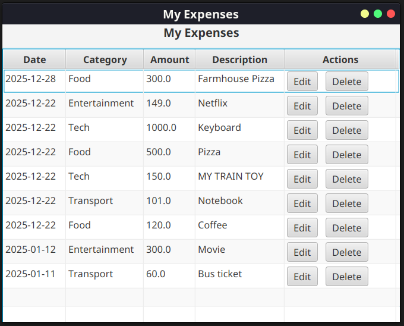
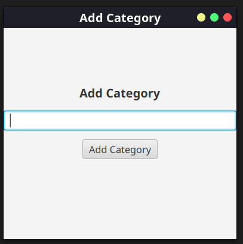
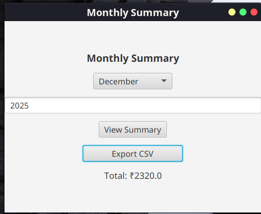
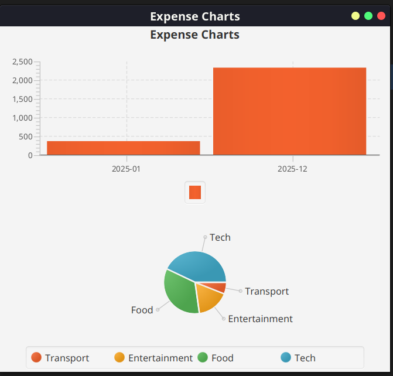

# Expense Tracker

A Java-based Expense Tracker application to record, categorize, and manage daily expenses with persistent storage.

## Features
- Add, update, delete expenses
- Categorize expenses
- View expense summaries
- Data stored in MySQL
- Export data

## Tech Stack
- Java
- MySQL
- JDBC
- Maven


## Setup Instructions
1. Clone the repository
2. Create MySQL database
3. Update database credentials
4. Run the project

## How to Run
``` bash
mvn clean install
mvn exec:java
```

## Screenshots

### Login & Registration


### Dashboard


### Add Expense


### View Expenses


### Add Category


### Monthly Summary & Export


### Expense Analytics

